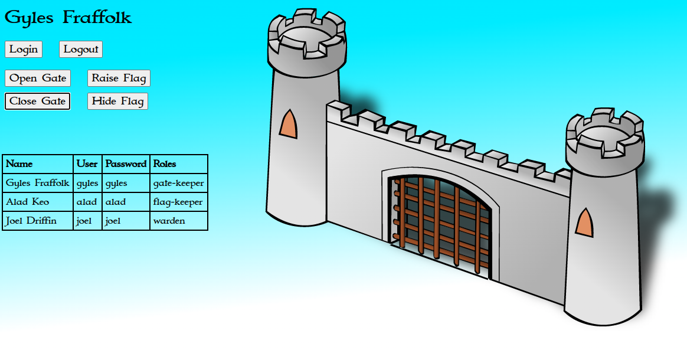

# 08 - Security sample - OpenID Connect

## OpenID Connect with Keycloak

1. Start Keycloak Identity Management server locally
    ```bash
    cd ch08-security
    bash startKeycloak.sh
    ```
    Script downloads, runs and configure Keycloak, last part of the script 
    updates client-id generated by Keycloak in your `application.yaml`.
    Keep it running and don't close the shell window.
    ```
    client-id: a45f5d68-5763-4eef-bec7-1d25a103b800
    jwt-key: c9xj3aDJocE-w8mU8AqZUv96wH9rJjUm0vbB_g7Bxlw
    client-secret: TVgCa4FvXxfiOHpnROI6tWXJAOTX0etk
    
    Updating client-id in application.yaml
    
    Press Ctrl+C to stop Keycloak and exit
    ```
2. Build and run Castle application

    Open new shell window to build and run your application.
    ```shell
    cd ch08-security/02_open-id
    mvn clean package
    java -jar ./target/castle-open-id.jar
    ```
3. Open Castle application in browser
      
    Open http://localhost:8080 in your browser and login as one of the following users(user/pass):
   * `gyles`/`gyles` - Gatekeeper, can control only the gate
   * `alad`/`alad` - Flagkeeper, can control only the flag
   * `joel`/`joel` - Warden of the castle, can control both gate and flag

    

4. Shutdown Keycloak and the Castle application

    You can close both by pressing `Ctrl+C` in their respective shell windows.